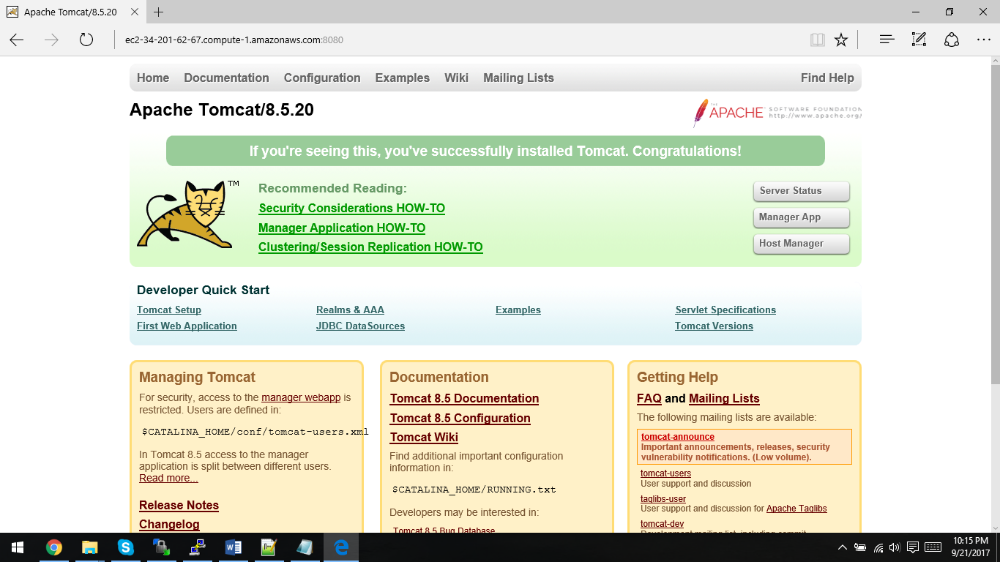

# Steps:-

\# Pre-req Java 8 , utilities Installation

sudo yum install java-1.8.0-openjdk -y

sudo yum install wget

\# tomcat 8 download

sudo mkdir /opt/tomcat

sudo chown ec2-user -R /opt/tomcat

cd /opt/tomcat

sudo wget [http://www.gtlib.gatech.edu/pub/apache/tomcat/tomcat-8/v8.5.23/bin/apache-tomcat-8.5.23.tar.gz](http://www.gtlib.gatech.edu/pub/apache/tomcat/tomcat-8/v8.5.23/bin/apache-tomcat-8.5.23.tar.gz)

sudo tar -xvf apache-tomcat-8.5.23.tar.gz

sudo chown ec2-user -R /opt/tomcat

cd /opt/tomcat/apache-tomcat-8.5.23/bin

./startup.sh

\# Test the tomcat startup

Goto :-

http://&lt;&lt;ec2-public-DNS&gt;&gt;:8080/

ex: [http://ec2-34-201-62-67.compute-1.amazonaws.com:8080/](http://ec2-34-201-62-67.compute-1.amazonaws.com:8080/)

\# Shutdown after confirmation

./shutdown.sh

